# AI+CloudOps

AI 驱动的云原生运维平台


## 目录

- [AI+CloudOps](#aicloudops)
  - [目录](#目录)
  - [项目介绍](#项目介绍)
  - [项目演示](#项目演示)
  - [快速开始](#快速开始)
    - [环境准备](#环境准备)
    - [克隆项目](#克隆项目)
    - [开发模式](#开发模式)
    - [生产模式](#生产模式)
  - [项目结构](#项目结构)
  - [许可证](#许可证)
  - [联系方式](#联系方式)
  - [Star History](#star-history)
  - [致谢](#致谢)

## 项目介绍

AI+CloudOps 是一个面向企业的 AI 驱动云原生运维管理平台，旨在通过人工智能技术提升运维效率和智能化水平。平台包含以下核心模块：

1. **AIOps 模块**：通过机器学习和 AI 技术，分析系统日志、监控数据，提供智能告警、故障预测和根因分析。
2. **用户与权限**：管理用户、角色及权限，确保系统的安全和可控性。
3. **服务树与 CMDB**：提供可视化的服务树结构和配置管理数据库（CMDB），实现运维资源的全面管理。
4. **工单系统**：支持工单的创建、分配、处理和追踪，提高问题解决效率。
5. **Prometheus 集成**：实时监控系统性能，结合 AI 技术，进行异常预警和自动化响应。
6. **Kubernetes 管理**：支持 Kubernetes 集群的管理与监控，简化云端资源操作，集成 AI 进行自动化优化和资源调度。

## 项目演示

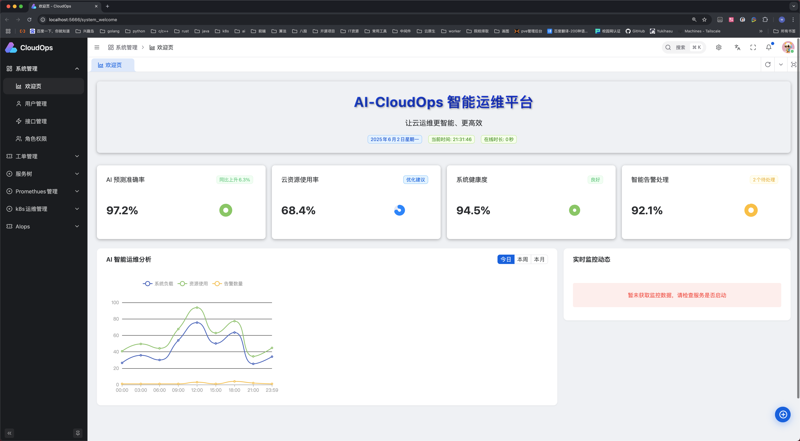
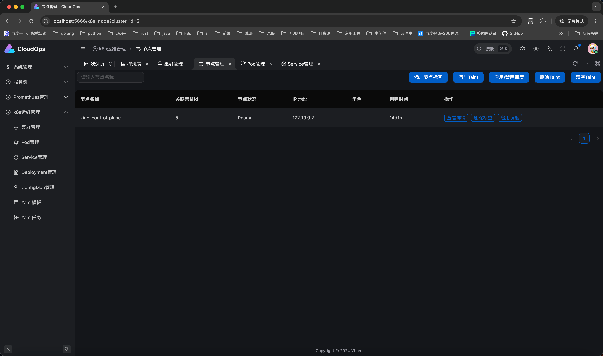

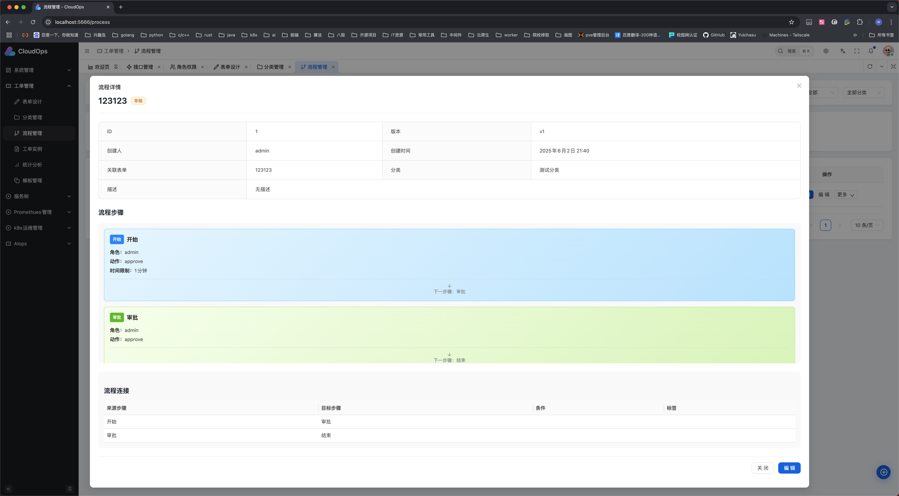
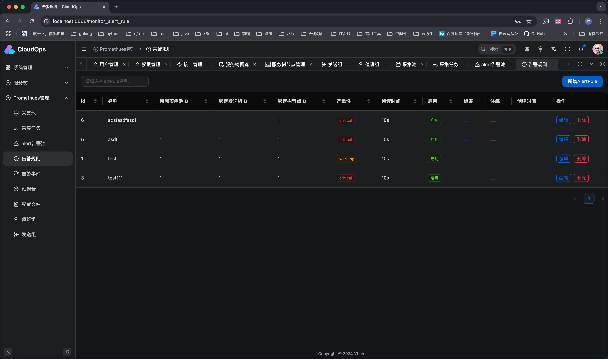
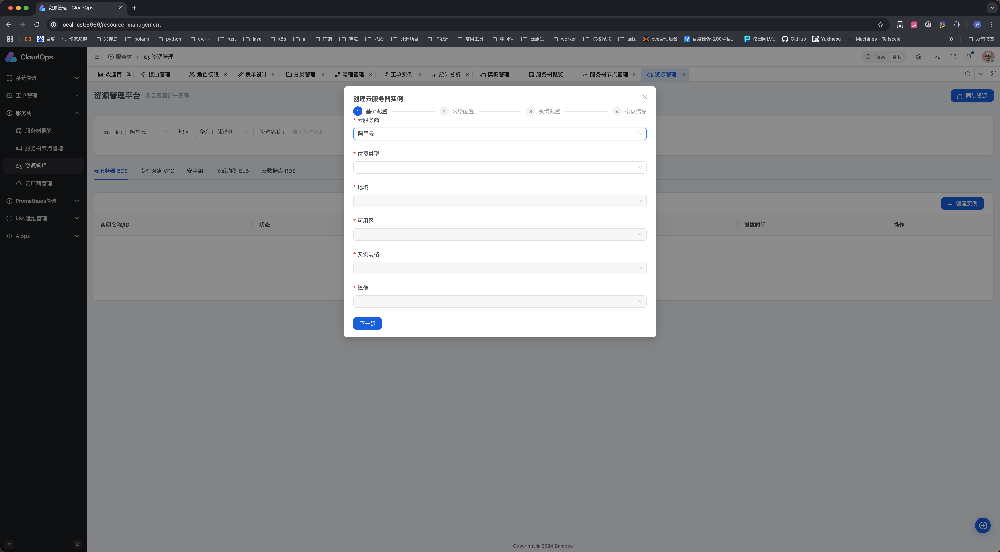
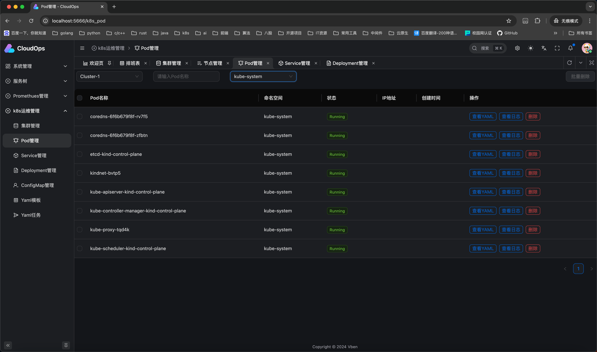
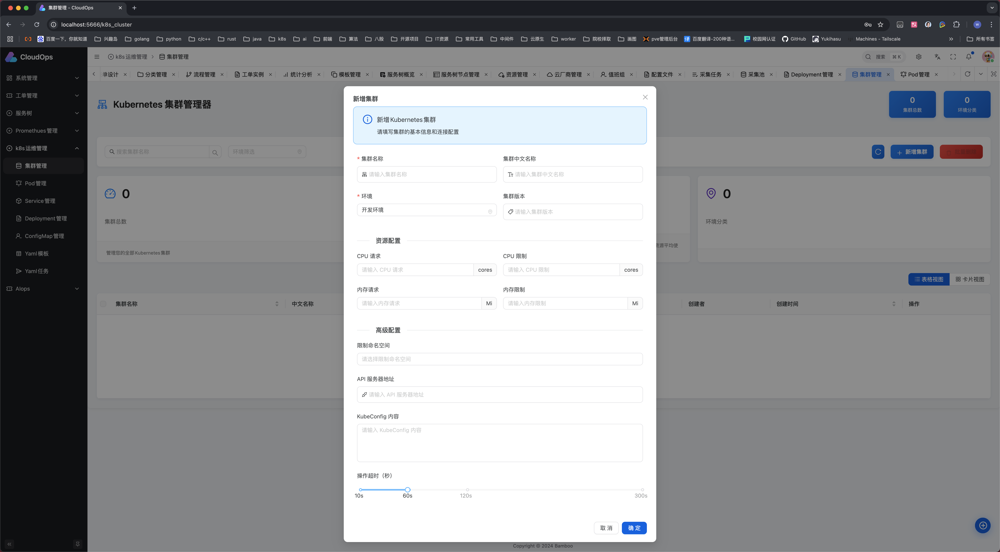
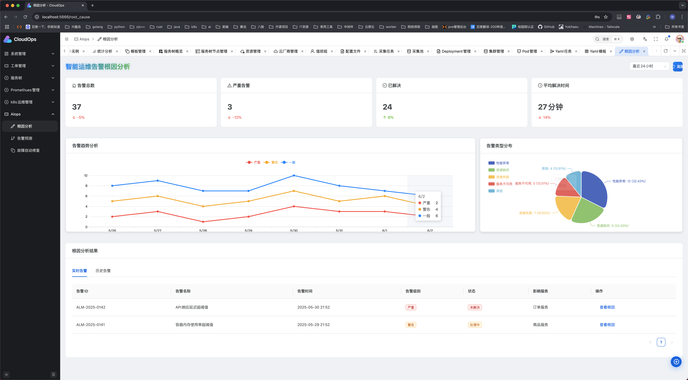
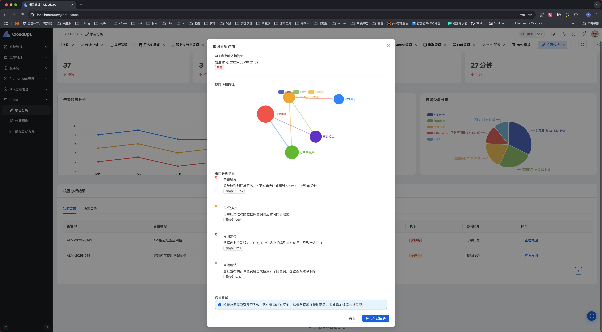
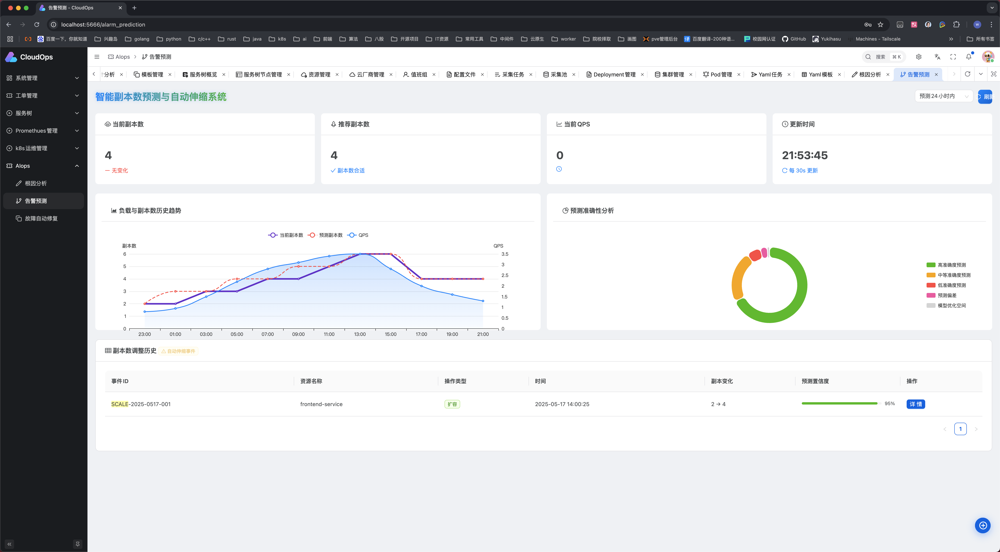
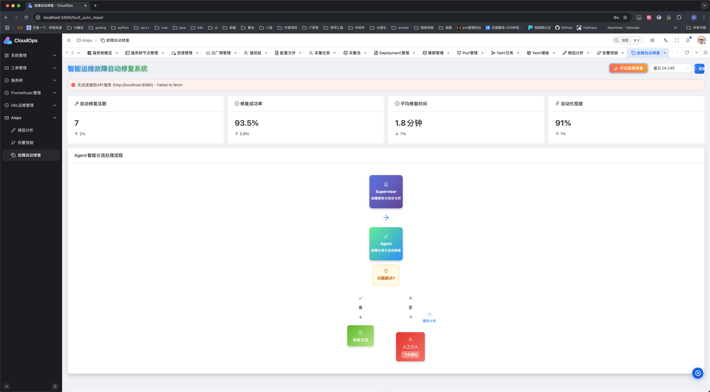
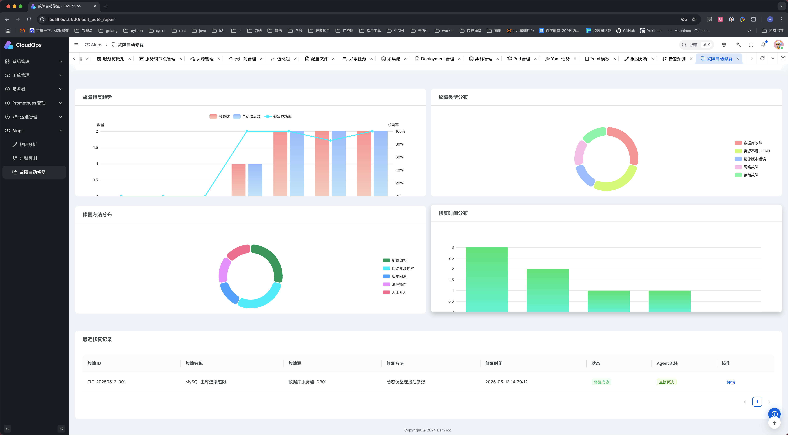

## 快速开始

### 环境准备

- Go 1.21+
- Node.js 21.x (推荐)
- pnpm
- Docker & Docker Compose
- Python 3.11.x

### 克隆项目

```bash
# 克隆后端项目
git clone https://github.com/GoSimplicity/AI-CloudOps.git
cd AI-CloudOps

# 克隆前端项目
git clone https://github.com/GoSimplicity/AI-CloudOps-web.git
```

### 开发模式

1. **启动依赖服务**：

```bash
# 在 AI-CloudOps 目录下启动所需的中间件(MySQL, Redis等)
docker-compose -f docker-compose-env.yaml up -d

# 复制环境变量配置文件（如果需要）
cp env.example .env
# 根据您的环境修改 .env 文件中的配置
```

2. **启动前端开发服务**：

```bash
# 进入前端项目目录
cd AI-CloudOps-web

# 安装依赖
pnpm install

# 启动前端开发服务器
pnpm run dev
```

前端服务默认启动在 `http://localhost:3000`

3. **启动后端开发服务**：

```bash
# 回到后端项目目录
cd ../AI-CloudOps

# 安装 Go 依赖
go mod tidy

# 运行后端服务
go run main.go
```

后端服务默认启动在 `http://localhost:8000`

4. **启动 MCP SSE 服务**：

```bash
# 在 AI-CloudOps 目录下
go run cmd/mcp/mcp.go
```

5. **启动 AIOps 服务**：

```bash
# 在 AI-CloudOps 目录下
cd python

# 安装依赖
pip install -r requirements.txt

# 训练流量预测模型
cd data && python machine-learing.py && cd ..

# 启动初始化脚本
bash scripts/setup.sh

# 启动主服务
bash scripts/start.sh
```

### 生产模式

1. **构建前端**：

```bash
# 进入前端项目目录
cd AI-CloudOps-web

# 安装依赖
pnpm install

# 构建前端静态文件
pnpm run build
```

2. **部署前端静态文件**：

将构建生成的 `dist/` 目录中的文件部署到您的静态资源服务器，或者：

- 使用 Nginx 提供静态文件服务
- 部署到 CDN
- 使用 Vercel、Netlify 等平台进行自动部署

3. **启动后端生产服务**：

```bash
# 回到后端项目目录
cd ../AI-CloudOps

# 构建后端应用
go build -o bin/ai-cloudops main.go

# 启动后端服务
./bin/ai-cloudops
```

4. **使用 Docker Compose 启动完整应用**：

```bash
# 启动依赖服务
docker-compose -f docker-compose-env.yaml up -d

# 启动应用服务
docker-compose up -d
```

## 项目结构

### 后端项目结构 (AI-CloudOps)

```text
AI-CloudOps/
│
├── bin/                  # 编译产物目录
├── cmd/                  # 可执行程序的主入口
├── config/               # 配置文件目录
├── data/                 # 数据文件
├── deploy/               # 部署相关文件
├── dify/                 # Dify AI集成
├── docker-compose-env.yaml # 开发环境依赖服务配置
├── docker-compose.yaml   # 应用服务配置
├── Dockerfile            # Docker构建文件
├── image/                # 项目图片资源
├── internal/             # 内部模块与业务逻辑
├── LICENSE               # 许可证文件
├── local_yaml/           # 本地配置文件
├── logs/                 # 日志文件目录
├── main.go               # 主程序入口
├── Makefile              # 项目构建和管理文件
├── modd.conf             # 开发热重载配置
├── pkg/                  # 公共库和工具包
├── python/               # Python脚本和AI模型
├── README.md             # 项目说明文档
├── terraform/            # 基础设施即代码
├── test/                 # 测试文件
└── tmp/                  # 临时文件
```

### 前端项目结构 (AI-CloudOps-web)

```text
AI-CloudOps-web/
│
├── .vscode/              # VSCode 配置
├── apps/                 # 应用程序目录
│   └── web-antd/         # 基于 Ant Design 的 Web 应用
├── internal/             # 内部模块
├── packages/             # 共享包
├── scripts/              # 构建和部署脚本
├── .env                  # 环境变量配置
├── package.json          # 项目依赖和脚本
├── pnpm-lock.yaml        # pnpm 依赖锁定文件
├── pnpm-workspace.yaml   # pnpm 工作区配置
├── turbo.json            # Turbo 构建配置
├── vite.config.ts        # Vite 配置文件
└── README.md             # 前端项目说明文档
```

## 许可证

本项目使用 [MIT 许可证](./LICENSE)，详情请查看 LICENSE 文件。

## 联系方式

如果有任何问题或建议，欢迎通过以下方式联系我：

- Email: [bamboocloudops@gmail.com](mailto:bamboocloudops@gmail.com)
- 微信：GoSimplicity（加我后可邀请进微信群交流）

## Star History

[](https://star-history.com/#GoSimplicity/AI-CloudOps&Date)

## 致谢

感谢所有为本项目贡献代码、文档和建议的人！AI+CloudOps 的发展离不开社区的支持和贡献。

---

欢迎加入 AI+CloudOps 云原生运维平台，期待你的参与和贡献！
