<div align="center">

# 🚀 AI+CloudOps

### 🌟 智能化云原生运维管理平台 🌟

*融合人工智能与云原生技术，重新定义企业运维管理体验*

<p align="center">
    <a href="https://golang.org/"></a>
    <a href="https://reactjs.org/"></a>
    <a href="https://kubernetes.io/"></a>
    <a href="https://prometheus.io/"></a>
</p>

<p align="center">
    <a href="https://opensource.org/licenses/MIT"></a>
    <a href="https://github.com/GoSimplicity/AI-CloudOps/stargazers"></a>
    <a href="https://github.com/GoSimplicity/AI-CloudOps/network"></a>
    <a href="https://github.com/GoSimplicity/AI-CloudOps/issues"></a>
    <a href="https://github.com/GoSimplicity/AI-CloudOps/actions"></a>
</p>

<p align="center">
    <a href="https://goreportcard.com/report/github.com/GoSimplicity/AI-CloudOps"></a>
    <a href="https://codecov.io/gh/GoSimplicity/AI-CloudOps"></a>
    <a href="https://github.com/GoSimplicity/AI-CloudOps/releases"></a>
</p>


</div>

---

## 🌈 项目介绍 (Introduction)

<div align="center">

### 💡 为什么选择 AI+CloudOps？

**AI+CloudOps** 不仅仅是一个运维平台，它是您数字化转型路上的智能伙伴。我们深度融合人工智能与云原生技术，为企业提供前所未有的运维管理体验。

</div>

<table>
<tr>
<td width="50%">

#### 🎯 核心优势
- **🤖 AI 驱动**: 机器学习算法实现智能预警和自动修复
- **☁️ 云原生**: 深度集成 Kubernetes 和微服务架构
- **🔒 企业级**: 多层级权限控制，满足大型企业需求
- **📊 可视化**: 直观的监控面板和数据分析
- **🚀 高性能**: Go 语言后端，React 前端，性能卓越
- **🔧 易扩展**: 微服务架构，支持灵活定制和扩展

</td>
<td width="50%">

#### 🏢 适用场景
- **大中型企业** 的 IT 运维团队
- **互联网公司** 的 DevOps 实践
- **金融机构** 的稳定性要求
- **制造业** 的数字化转型
- **教育科研** 机构的 IT 管理
- **政府机构** 的信息化建设

</td>
</tr>
</table>

### 🔗 项目生态 (Project Ecosystem)

<div align="center">

|                                   仓库                                   |      描述       |              技术栈               |                             状态                              |
| :----------------------------------------------------------------------: | :-------------: | :-------------------------------: | :-----------------------------------------------------------: |
|       [🔧 AI-CloudOps](https://github.com/GoSimplicity/AI-CloudOps)       |  核心后端服务   |          Go + Gin + GORM          |  |
|   [🎨 AI-CloudOps-web](https://github.com/GoSimplicity/AI-CloudOps-web)   |  前端用户界面   | Vue + TypeScript + Ant Design vue |  |
| [🧠 AI-CloudOps-aiops](https://github.com/GoSimplicity/AI-CloudOps-aiops) | AI 智能运维模块 |  Python + FastAPI + scikit-learn  |  |

</div>

## ✨ 核心功能特性 (Core Features)

<div align="center">

### 🎨 功能架构图

```
┌─────────────────┐    ┌─────────────────┐    ┌─────────────────┐
│   🎯 前端界面    │ ──▶ │   🔧 核心后端    │ ──▶ │   🧠 AI 分析     │
│  React + TS     │    │   Go + Gin      │    │  Python + ML    │
└─────────────────┘    └─────────────────┘    └─────────────────┘
         │                       │                       │
         └───────────────────────┼───────────────────────┘
                                 ▼
                    ┌─────────────────────────┐
                    │     ☁️ 云原生基础设施     │
                    │  K8s + Prometheus + 🗄️   │
                    └─────────────────────────┘
```

</div>

<table>
<tr>
<td width="33%">

### 🤖 智能运维 (AIOps)
- **📊 智能监控**: ML 算法分析监控数据
- **🔍 异常检测**: 自动识别系统异常
- **💡 故障预测**: 提前预警潜在问题
- **🛠️ 自动修复**: 智能化故障处理
- **📈 趋势分析**: 性能趋势预测
- **🎯 根因分析**: 快速定位问题根源

</td>
<td width="33%">

### 🔐 权限管理 (RBAC)
- **👥 多租户**: 支持多组织架构
- **🎭 角色管理**: 灵活的角色定义
- **🔑 权限控制**: 细粒度权限分配
- **🛡️ 安全审计**: 完整的操作日志
- **📝 合规支持**: 符合企业安全标准
- **🔄 动态授权**: 实时权限更新

</td>
<td width="33%">

### 🌲 资源管理 (CMDB)
- **🗂️ 服务树**: 可视化资源拓扑
- **📋 资产清单**: 自动化资产发现
- **🔗 依赖关系**: 服务依赖图谱
- **📊 资源监控**: 实时资源状态
- **📈 容量规划**: 智能容量分析
- **🏷️ 标签管理**: 灵活的资源分类

</td>
</tr>
<tr>
<td width="33%">

### 📋 工单系统 (Workflow)
- **📝 工单模板**: 可定制工单类型
- **🔄 流程引擎**: 自动化审批流程
- **⏰ SLA 管理**: 服务等级协议监控
- **📊 统计分析**: 工单数据洞察
- **💬 协作沟通**: 内置沟通工具
- **📱 移动支持**: 随时随地处理工单

</td>
<td width="33%">

### 📡 监控告警 (Monitoring)
- **🔍 多维监控**: 全方位性能监控
- **⚡ 实时告警**: 秒级告警响应
- **📈 可视化**: 丰富的监控图表
- **🎯 智能阈值**: AI 动态阈值调整
- **📲 多渠道通知**: 邮件/短信/钉钉
- **📊 告警收敛**: 智能告警聚合

</td>
<td width="33%">

### ☸️ Kubernetes 管理
- **🖥️ 集群管理**: 多集群统一管理
- **🚀 应用部署**: 可视化应用部署
- **📊 资源监控**: Pod/Node 监控
- **🔄 自动扩缩**: HPA/VPA 支持
- **📋 配置管理**: ConfigMap/Secret
- **🔧 故障排查**: 日志聚合分析

</td>
</tr>
</table>

---

## 🌐 在线体验 (Live Demo)

<div align="center">

### 🎯 立即体验我们的平台

<table>
<tr>
<td align="center">


**演示地址**: [http://68.64.177.180](http://68.64.177.180)

**登录凭据**:
👤 **用户名**: `demo`
🔑 **密码**: `Demo@2025`

⚠️ *演示环境仅供测试，请勿上传敏感信息*
</td>
</tr>
</table>

### 🔥 快速导览

**🎨 仪表板**: 查看系统整体运行状态
**☸️ K8s 管理**: 体验 Kubernetes 集群管理
**📊 监控面板**: 感受实时监控能力
**🤖 AI 分析**: 尝试智能故障分析
**📋 工单系统**: 体验完整工单流程

</div>

## 📸 产品演示 (Product Screenshots)

<div align="center">

### 🎨 界面预览

<table>
<tr>
<td align="center" width="50%">
<h4>🔐 首页</h4>
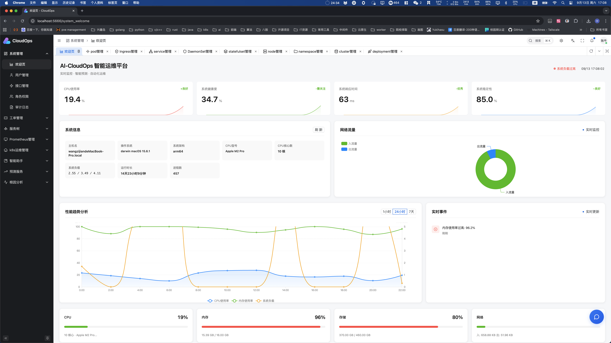
<em>现代化的登录界面设计</em>
</td>
<td align="center" width="50%">
<h4>📊 审计日志</h4>
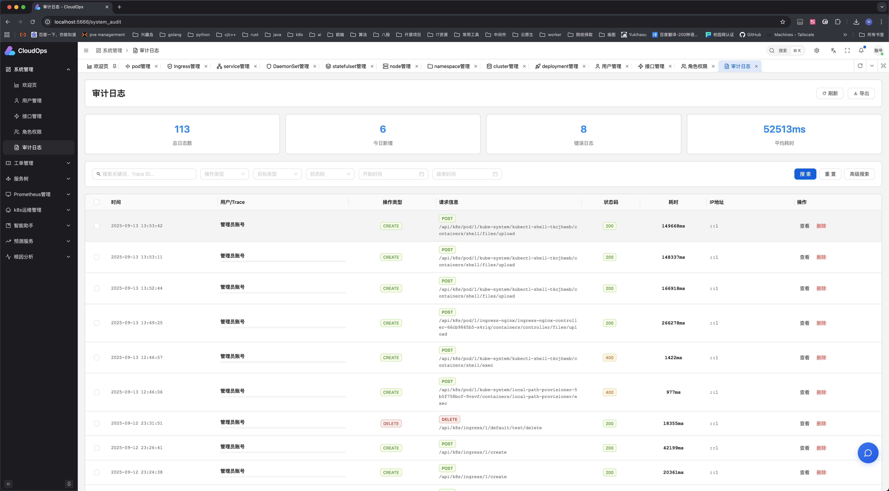
<em>审计日志管理</em>
</td>
</tr>
<tr>
<td align="center" width="50%">
<h4>⚙️ 表单设计</h4>
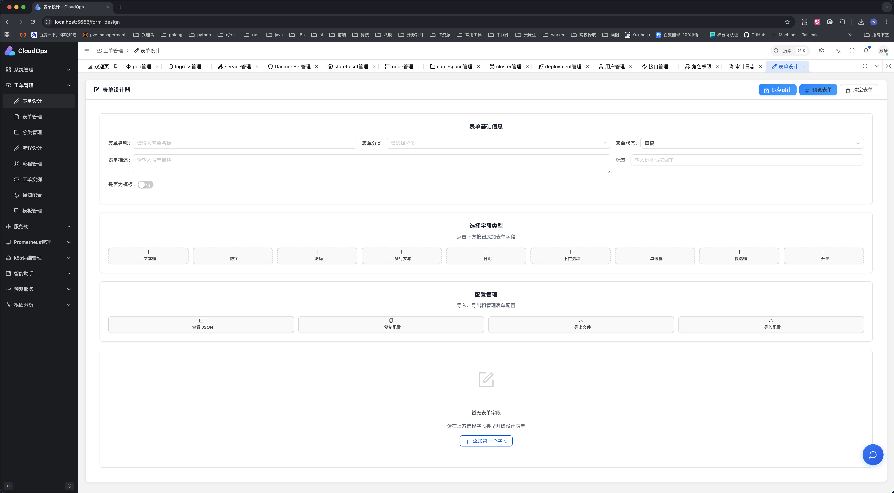
<em>表单设计管理</em>
</td>
<td align="center" width="50%">
<h4>📋 流程设计</h4>
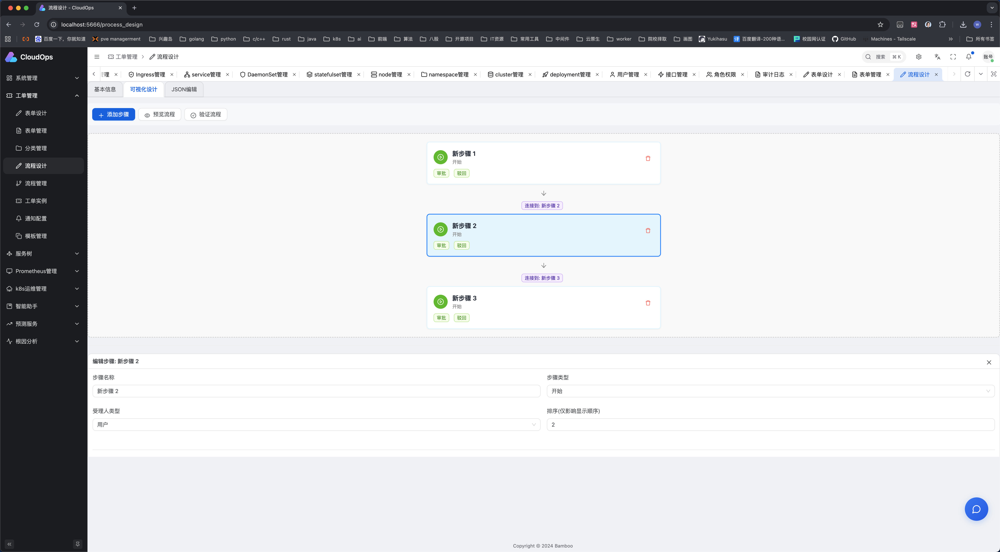
<em>流程设计管理</em>
</td>
</tr>
<tr>
<td align="center" width="50%">
<h4>🔄 通知管理</h4>
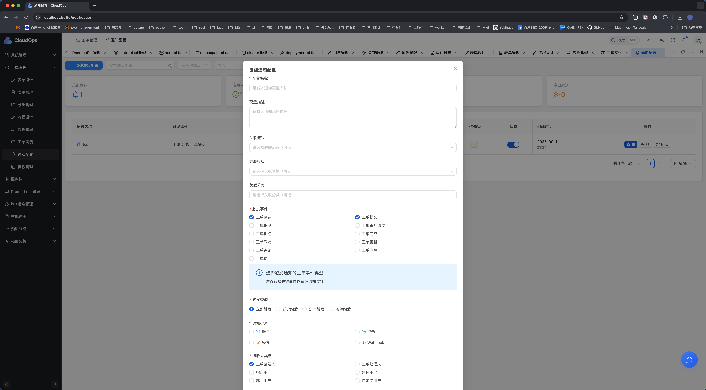
<em>通知管理</em>
</td>
<td align="center" width="50%">
<h4>🌲 服务树概览</h4>
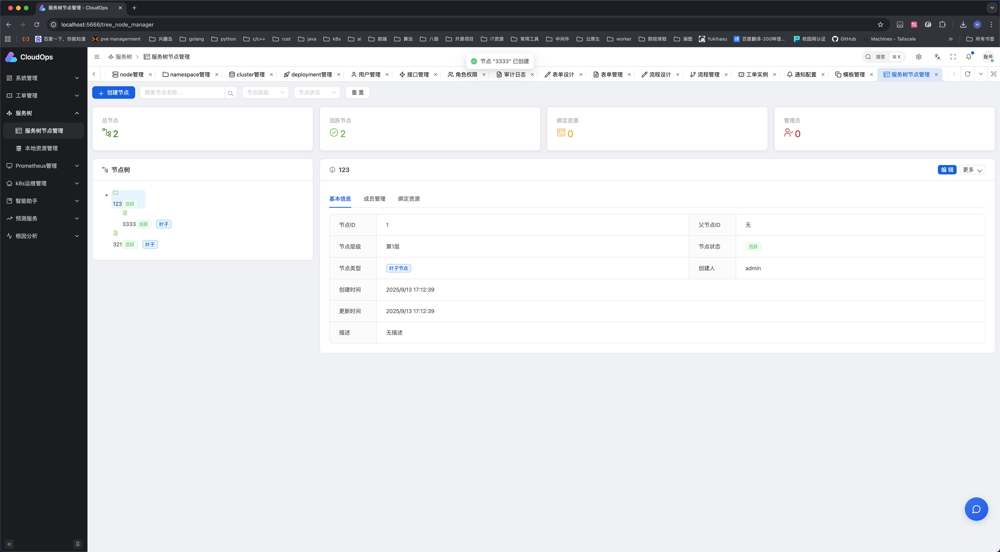
<em>清晰的服务依赖关系图</em>
</td>
</tr>
<tr>
<td align="center" width="50%">
<h4>📊 本地资源</h4>

<em>本地资源管理</em>
</td>
<td align="center" width="50%">
<h4>⚠️ 终端管理</h4>
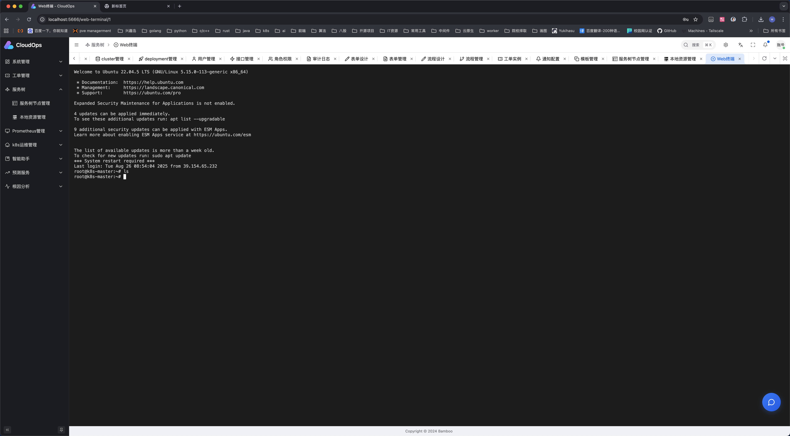
<em>终端管理</em>
</td>
</tr>
<tr>
<td align="center" width="50%">
<h4>📋 告警管理</h4>

<em>告警管理</em>
</td>
<td align="center" width="50%">
<h4>👥 发送组管理</h4>
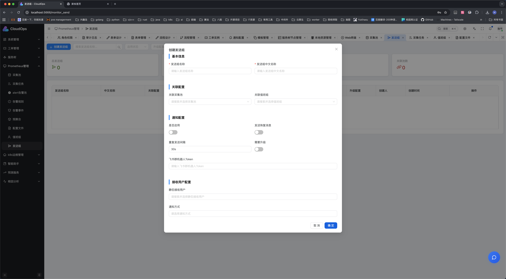
<em>发送组管理</em>
</td>
</tr>
<tr>
<td align="center" width="50%">
<h4>☸️ K8s 集群管理</h4>
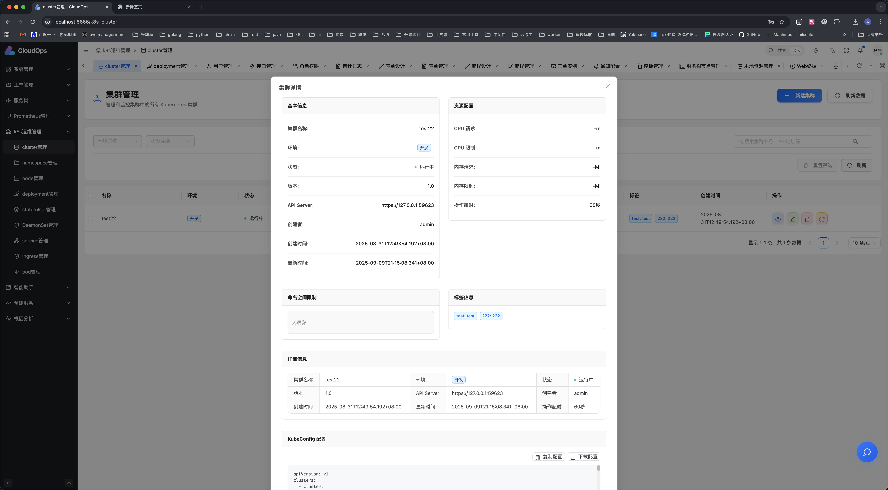
<em>多集群统一管理与监控</em>
</td>
<td align="center" width="50%">
<h4>🚀 K8s 应用部署</h4>
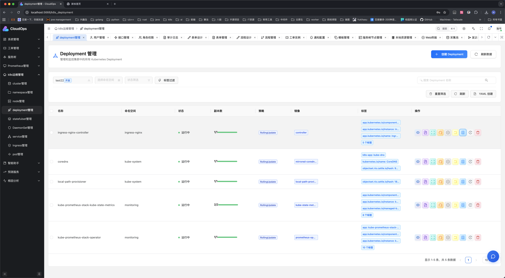
<em>可视化应用部署与管理</em>
</td>
</tr>
<tr>
<td align="center" width="50%">
<h4>🤖 实时日志流</h4>
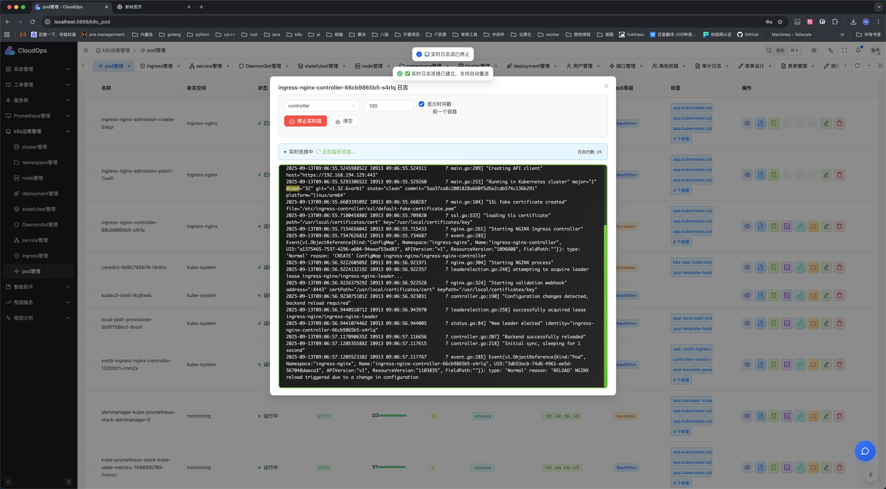
<em>实时日志流</em>
</td>
<td align="center" width="50%">
<h4>🔍 pod文件上传</h4>
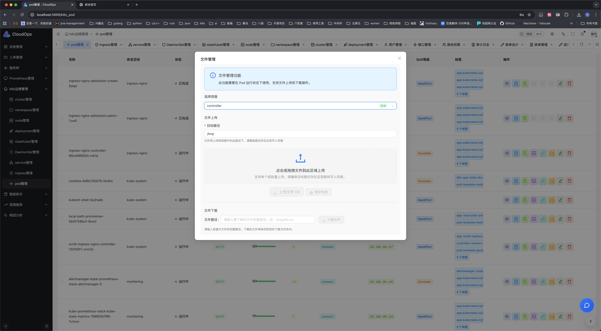
<em>pod文件上传</em>
</td>
</tr>
<tr>
<td align="center" colspan="2">
<h4>🛠️ AIOps智能运维</h4>
<table width="100%">
<tr>
<td align="center" width="50%">
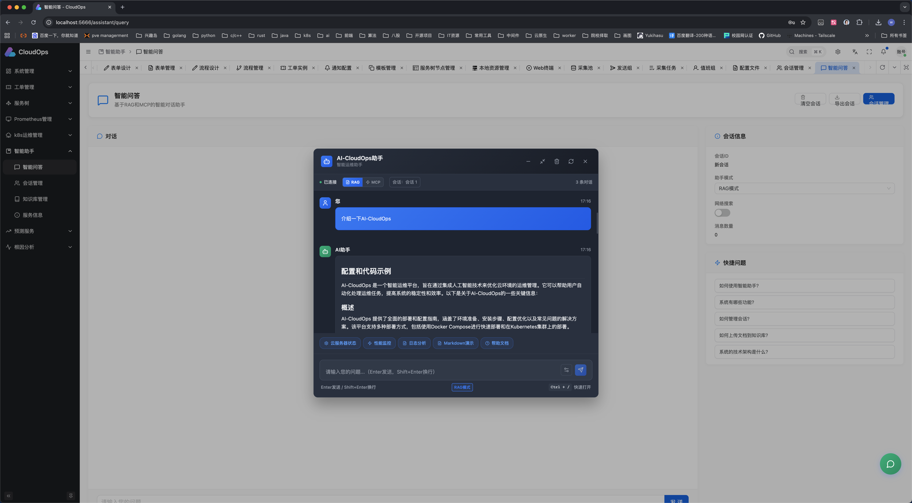
</td>
<td align="center" width="50%">
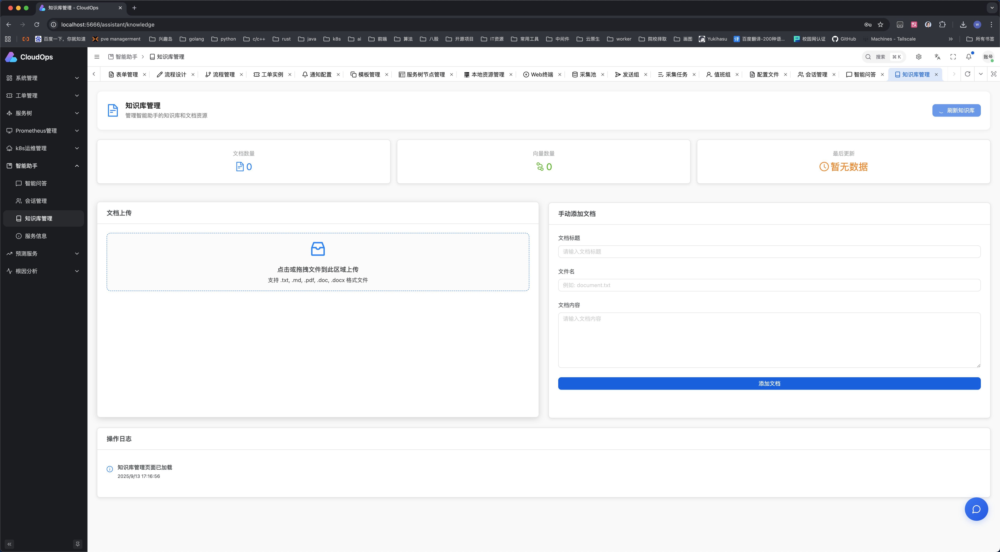
</td>
</tr>
</table>
<em>智能化的 Kubernetes 集群故障检测与自动修复</em>
</td>
</tr>
<tr>
<td align="center" width="50%">
<h4>📜 日志分析</h4>

<em>智能日志聚合与分析</em>
</td>
<td align="center" width="50%">
<h4>🌐 系统概览</h4>

<em>全局系统状态总览</em>
</td>
</tr>
</table>

</div>

---

## 🏆 核心贡献者 (Core Contributors)

<div align="center">

### 💪 感谢这些优秀的贡献者让项目变得更加出色！

<table>
<tr>
<td align="center" width="20%">
<a href="https://github.com/GoSimplicity">
<br />
<sub><b>🔧 GoSimplicity</b></sub>
</a>
<br />
<small>项目发起人 & 核心贡献者</small>
<br />

</td>
<td align="center" width="20%">
<a href="https://github.com/Penge666">
<br />
<sub><b>⚡ Penge666</b></sub>
</a>
<br />
<small>资深开发者</small>
<br />

</td>
<td align="center" width="20%">
<a href="https://github.com/shixiaocaia">
<br />
<sub><b>🌟 shixiaocaia</b></sub>
</a>
<br />
<small>资深贡献者</small>
<br />

</td>
<td align="center" width="20%">
<a href="https://github.com/daihao4371">
<br />
<sub><b>💼 daihao4371</b></sub>
</a>
<br />
<small>功能开发者</small>
<br />

</td>
<td align="center" width="20%">
<a href="https://github.com/daichengwei">
<br />
<sub><b>🚴 骑自行车追狗</b></sub>
</a>
<br />
<small>活跃贡献者</small>
<br />

</td>
</tr>
</table>

### 🌟 贡献统计

<p align="center">

</p>

<table align="center">
<tr>
<td align="center">
<h4>📊 项目统计</h4>

<br/>

<br/>

</td>
<td align="center">
<h4>🎯 贡献指南</h4>

<br/>

<br/>

</td>
</tr>
</table>

</div>

## 🚀 快速开始 (Quick Start)

<div align="center">

### ⚡ 三步快速部署，五分钟上线体验

</div>

### 🛠️ 环境准备 (Prerequisites)

<table>
<tr>
<td width="50%">

#### 🔧 必需环境
-  **Go 1.21+**
-  **Node.js 21.x**
-  **pnpm latest**
-  **Docker & Docker Compose**
-  **Python 3.11+**

</td>
<td width="50%">

#### 🔍 环境检查命令
```bash
# 检查所有依赖
go version          # >= 1.23
node --version      # >= 21.0
pnpm --version      # latest
docker --version    # latest
python3 --version   # >= 3.11
```

</td>
</tr>
</table>

### 📦 获取源码 (Clone Repositories)

<div align="center">

#### 🔄 一键克隆所有项目

</div>

<table>
<tr>
<td align="center" width="33%">
<h4>🔧 后端服务</h4>


```bash
git clone https://github.com/GoSimplicity/AI-CloudOps.git
cd AI-CloudOps
```

</td>
<td align="center" width="33%">
<h4>🎨 前端应用</h4>


```bash
git clone https://github.com/GoSimplicity/AI-CloudOps-web.git
cd AI-CloudOps-web
```

</td>
<td align="center" width="33%">
<h4>🧠 AI 模块</h4>


```bash
git clone https://github.com/GoSimplicity/AI-CloudOps-aiops.git
cd AI-CloudOps-aiops
```

</td>
</tr>
</table>

<details>
<summary>📋 <b>批量克隆脚本</b></summary>

```bash
#!/bin/bash
# 一键克隆所有项目
echo "🚀 开始克隆 AI-CloudOps 项目组..."

repositories=(
    "https://github.com/GoSimplicity/AI-CloudOps.git"
    "https://github.com/GoSimplicity/AI-CloudOps-web.git" 
    "https://github.com/GoSimplicity/AI-CloudOps-aiops.git"
)

for repo in "${repositories[@]}"; do
    echo "📦 克隆 $repo"
    git clone "$repo"
done

echo "✅ 所有项目克隆完成！"
```

</details>

### 🔥 开发模式 (Development Mode)

<div align="center">

#### 🚀 四步启动完整开发环境

</div>

<table>
<tr>
<td align="center" width="25%">
<h4>1️⃣ 启动基础设施</h4>

</td>
<td align="center" width="25%">
<h4>2️⃣ 启动前端</h4>

</td>
<td align="center" width="25%">
<h4>3️⃣ 启动后端</h4>

</td>
<td align="center" width="25%">
<h4>4️⃣ 启动 AI 服务</h4>

</td>
</tr>
</table>

---

#### 🏗️ 步骤一：启动基础设施

<table>
<tr>
<td width="60%">

```bash
# 进入后端项目目录
cd AI-CloudOps

# 🐳 使用 Docker Compose 启动中间件
docker-compose -f docker-compose-env.yaml up -d

# ⚙️ 配置环境变量
cp env.example .env

# 🔍 检查服务状态
docker-compose -f docker-compose-env.yaml ps
```

</td>
<td width="40%">

**🔧 启动的服务:**
-  **MySQL 8.0**
-  **Redis 7.0**
-  **Prometheus**
-  **Grafana**

</td>
</tr>
</table>

---

#### 🎨 步骤二：启动前端服务

<table>
<tr>
<td width="60%">

```bash
# 进入前端项目目录
cd ../AI-CloudOps-web

# 📦 安装依赖
pnpm install

# 🚀 启动开发服务器
pnpm run dev
```

</td>
<td width="40%">

**🌐 访问地址:**
- **开发环境**: [http://localhost:3000](http://localhost:3000)
- **热重载**: ✅ 自动
- **构建工具**: Vite + Turbo
- **代码检查**: ESLint + Prettier

</td>
</tr>
</table>

---

#### 🔧 步骤三：启动后端服务

<table>
<tr>
<td width="60%">

```bash
# 回到后端项目目录
cd ../AI-CloudOps

# 📥 安装 Go 依赖
go mod tidy

# 🚀 启动后端主服务
go run main.go
```

</td>
<td width="40%">

**🔗 服务地址:**
- **API 服务**: [http://localhost:8000](http://localhost:8000)
- **Swagger 文档**: [http://localhost:8000/swagger](http://localhost:8000/swagger)
- **健康检查**: [http://localhost:8000/health](http://localhost:8000/health)
- **性能监控**: 内置 pprof

</td>
</tr>
</table>

---

#### 🧠 步骤四：启动 AI 服务 (可选)

<table>
<tr>
<td width="60%">

```bash
# 进入 AIOps 项目目录
cd ../AI-CloudOps-aiops

# ⚙️ 配置环境变量
cp env.example .env

# 📦 安装 Python 依赖
pip install -r requirements.txt

# 🤖 训练机器学习模型 (首次运行)
cd data/ && python machine-learning.py && cd ..

# 🚀 启动 AI 服务
python app/main.py
```

</td>
<td width="40%">

**🤖 AI 能力:**
- **异常检测**: 基于机器学习
- **故障预测**: 时间序列分析
- **根因分析**: 知识图谱
- **自动修复**: 规则引擎
- **API 地址**: [http://localhost:8001](http://localhost:8001)

</td>
</tr>
</table>

<div align="center">

### 🎉 恭喜！开发环境启动完成


**现在可以通过 [http://localhost:3000](http://localhost:3000) 访问完整的应用程序了！**

</div>

### 🚀 生产部署 (Production Deployment)

<div align="center">

#### 🏭 企业级生产环境部署方案

</div>

<table>
<tr>
<td align="center" width="33%">
<h4>🏗️ 传统部署</h4>

<p>手动构建和部署</p>
</td>
<td align="center" width="33%">
<h4>🐳 容器化部署</h4>

<p><strong>推荐方案</strong></p>
</td>
<td align="center" width="33%">
<h4>☸️ K8s 部署</h4>

<p>云原生生产级</p>
</td>
</tr>
</table>

---

#### 🏗️ 方案一：传统构建部署

<details>
<summary><b>📦 前端构建</b></summary>

```bash
# 进入前端项目目录
cd AI-CloudOps-web

# 📦 安装依赖
pnpm install

# 🔨 构建生产版本
pnpm run build

# 📊 查看构建结果
ls -la dist/
```

**🌐 Nginx 配置示例:**
```nginx
server {
    listen 80;
    server_name your-domain.com;
    
    location / {
        root /var/www/ai-cloudops/dist;
        try_files $uri $uri/ /index.html;
    }
    
    location /api/ {
        proxy_pass http://localhost:8000/api/;
        proxy_set_header Host $host;
        proxy_set_header X-Real-IP $remote_addr;
    }
}
```

</details>

<details>
<summary><b>🔧 后端构建</b></summary>

```bash
# 回到后端项目目录
cd AI-CloudOps

# 🔨 构建生产二进制
go build -o bin/ai-cloudops main.go

# ⚙️ 配置生产环境变量
cp config/config.production.yaml config.yaml

# 🚀 启动生产服务
./bin/ai-cloudops
```

**🔧 Systemd 服务配置:**
```ini
[Unit]
Description=AI-CloudOps Backend Service
After=network.target

[Service]
Type=simple
User=cloudops
WorkingDirectory=/opt/ai-cloudops
ExecStart=/opt/ai-cloudops/bin/ai-cloudops
Restart=always

[Install]
WantedBy=multi-user.target
```

</details>

---

#### 🐳 方案二：Docker Compose 部署 (推荐)

<div align="center">

</div>

```bash
# 📁 在 AI-CloudOps 项目根目录
cd AI-CloudOps

# 🚀 一键启动所有服务
docker-compose up -d

# 🔍 查看服务状态
docker-compose ps

# 📊 查看服务日志
docker-compose logs -f
```

**🔧 高级配置选项:**
```bash
# 🔄 仅更新某个服务
docker-compose up -d backend

# 📊 监控资源使用
docker-compose top

# 🧹 清理和重启
docker-compose down && docker-compose up -d
```

---

#### ☸️ 方案三：Kubernetes 部署

<details>
<summary><b>🚀 云原生生产级部署</b></summary>

```bash
# 📁 进入 Kubernetes 部署目录
cd deploy/kubernetes/

# ⚙️ 配置环境变量
cp config.example config

# 🚀 部署到 Kubernetes
kubectl apply -f .

# 🔍 查看部署状态
kubectl get pods,svc,ingress -l app=ai-cloudops
```

**📊 部署架构:**
```
┌─────────────────┐    ┌─────────────────┐    ┌─────────────────┐
│   📱 前端 Pod    │───▶│   🔧 后端 Pod    │───▶│   🧠 AI Pod     │
│   React App     │    │   Go Service    │    │  Python ML     │
│   (多副本)       │    │   (多副本)       │    │   (多副本)      │
└─────────────────┘    └─────────────────┘    └─────────────────┘
         │                       │                       │
         └───────────────────────┼───────────────────────┘
                                 ▼
                    ┌─────────────────────────┐
                    │      🗄️ 数据层 Pod      │
                    │  MySQL + Redis + 监控   │
                    └─────────────────────────┘
```

</details>

<div align="center">

### ✅ 部署检查清单

<table>
<tr>
<td align="center">

**🔧 后端服务**
- [ ] 服务启动成功
- [ ] 数据库连接正常
- [ ] API 接口可访问
- [ ] 健康检查通过

</td>
<td align="center">

**🎨 前端应用**
- [ ] 静态资源加载
- [ ] 路由配置正确
- [ ] API 调用成功
- [ ] 页面渲染正常

</td>
<td align="center">

**📊 监控告警**
- [ ] 监控指标采集
- [ ] 告警规则配置
- [ ] 日志聚合正常
- [ ] 性能指标正常

</td>
</tr>
</table>

</div>

## 🏗️ 项目架构 (Project Architecture)

<div align="center">

### 🎯 微服务架构设计


</div>

### 📁 后端结构 (Backend Structure)

<details>
<summary><b>🔧 AI-CloudOps 后端架构</b></summary>

```
AI-CloudOps/
├── 📁 cmd/                    # 命令行入口
│   └── webhook/               # Webhook 服务
├── 📁 config/                 # 配置文件
│   ├── config.development.yaml
│   ├── config.production.yaml
│   └── webhook.yaml
├── 📁 deploy/                 # 部署配置
│   ├── kubernetes/            # K8s 部署文件
│   ├── mysql/                 # 数据库初始化
│   ├── nginx/                 # 反向代理配置
│   └── prometheus/            # 监控配置
├── 📁 internal/               # 核心业务逻辑
│   ├── 🔐 middleware/         # 中间件 (认证、日志等)
│   ├── 📊 model/              # 数据模型
│   ├── 🏭 k8s/                # K8s 管理模块
│   ├── 👥 user/               # 用户管理
│   ├── 📈 prometheus/         # 监控指标
│   ├── 📋 workorder/          # 工单系统
│   ├── 🌲 tree/               # 服务树 CMDB
│   └── 🔧 system/             # 系统管理
├── 📁 pkg/                    # 公共工具包
│   ├── di/                    # 依赖注入
│   ├── utils/                 # 工具函数
│   ├── ssh/                   # SSH 连接
│   └── websocket/             # WebSocket 支持
├── 📁 docs/                   # API 文档
│   ├── swagger.json
│   └── swagger.yaml
├── main.go                    # 程序入口
├── Dockerfile                 # 容器构建
├── docker-compose.yaml        # 本地开发环境
└── go.mod                     # Go 模块管理
```

**🏛️ 架构层级:**
- **🌐 API Layer**: RESTful API 接口层
- **🔄 Service Layer**: 业务逻辑服务层
- **💾 Repository Layer**: 数据访问层
- **🗄️ Infrastructure Layer**: 基础设施层

</details>

### 🎨 前端结构 (Frontend Structure)

<details>
<summary><b>⚡ AI-CloudOps-web 前端架构</b></summary>

```
AI-CloudOps-web/
├── 📁 apps/                   # 应用程序目录
│   └── web-antd/              # 主应用 (Ant Design + Vue)
│       ├── src/
│       │   ├── 📁 api/        # API 接口层
│       │   ├── app.vue        # 根组件
│       │   ├── bootstrap.ts   # 应用启动配置
│       │   ├── 📁 composables/ # Vue Composables
│       │   ├── 📁 layouts/    # 布局组件
│       │   ├── 📁 locales/    # 国际化文件
│       │   ├── main.ts        # 应用入口
│       │   ├── preferences.ts # 用户偏好设置
│       │   ├── 📁 router/     # 路由配置
│       │   ├── 📁 store/      # 状态管理
│       │   ├── 📁 types/      # TypeScript 类型
│       │   └── 📁 views/      # 页面视图组件
│       ├── dist/              # 构建输出
│       ├── public/            # 静态资源
│       ├── index.html         # 入口 HTML
│       ├── package.json       # 项目依赖
│       ├── tailwind.config.mjs # Tailwind 配置
│       ├── tsconfig.json      # TypeScript 配置
│       └── vite.config.mts    # Vite 构建配置
├── 📁 packages/               # 共享包 (Monorepo)
├── 📁 internal/               # 内部工具包
├── 📁 docs/                   # 文档目录
├── 📁 scripts/                # 构建脚本
├── cspell.json                # 拼写检查配置
├── eslint.config.mjs          # ESLint 配置
├── stylelint.config.mjs       # 样式检查配置
├── vitest.config.ts           # 单元测试配置
├── vitest.workspace.ts        # 测试工作空间
├── turbo.json                 # Turborepo 配置
├── pnpm-workspace.yaml        # PNPM 工作空间
├── pnpm-lock.yaml             # 锁定文件
├── package.json               # 根项目依赖
└── README.md                  # 项目说明
```

**🎯 技术特性:**
- **⚡ Vite**: 极速构建工具
- **🎨 Ant Design**: 企业级 UI 组件
- **📱 响应式**: 适配多端设备
- **🔄 状态管理**: Zustand/Redux
- **📊 可视化**: ECharts/D3.js
- **🧪 测试**: Vitest + Testing Library

</details>

### 🧠 AI 模块结构 (AI Module Structure)

<details>
<summary><b>🤖 AI-CloudOps-aiops 智能模块</b></summary>

```
AI-CloudOps-aiops/
├── 📁 app/                    # 应用主代码
│   ├── __init__.py            # 包初始化文件
│   ├── main.py                # FastAPI 入口
│   ├── 📁 api/                # API 路由层
│   ├── 📁 common/             # 通用模块
│   ├── 📁 config/             # 应用配置
│   ├── 📁 core/               # 核心业务逻辑
│   ├── 📁 mcp/                # MCP 协议实现
│   ├── 📁 models/             # 数据模型定义
│   ├── 📁 services/           # 业务服务层
│   └── 📁 utils/              # 工具函数
├── 📁 config/                 # 全局配置文件
├── 📁 data/                   # 数据存储
├── 📁 deploy/                 # 部署配置
├── 📁 docs/                   # 文档目录
├── 📁 logs/                   # 日志文件
├── 📁 scripts/                # 脚本工具
├── 📁 tests/                  # 测试用例
├── 📁 tools/                  # 开发工具
├── Dockerfile                 # 容器构建文件
├── Dockerfile.mcp             # MCP 服务容器
├── docker-compose.yml         # 本地开发环境
├── env.example                # 环境变量模板
├── LICENSE                    # 开源许可证
├── pyproject.toml             # Python 项目配置
├── pytest.ini                # 测试配置
├── README.md                  # 项目说明
└── requirements.txt           # Python 依赖
```

**🧠 AI 能力:**
- **📊 时间序列分析**: LSTM, ARIMA, Prophet
- **🔍 异常检测**: Isolation Forest, LOF
- **🎯 分类预测**: Random Forest, XGBoost
- **📈 回归分析**: Linear, Polynomial, SVR
- **🕸️ 知识图谱**: Neo4j, NetworkX
- **📝 NLP 处理**: BERT, Word2Vec

</details>

## 🤝 贡献指南 (Contributing Guide)

<div align="center">

### 🌟 我们欢迎所有形式的贡献！


</div>

### 🚀 快速开始贡献

<table>
<tr>
<td width="50%">

#### 📝 代码贡献流程

```bash
# 1. Fork 仓库
gh repo fork GoSimplicity/AI-CloudOps

# 2. 克隆到本地
git clone https://github.com/YOUR_USERNAME/AI-CloudOps.git

# 3. 创建特性分支
git checkout -b feature/amazing-feature

# 4. 提交更改
git commit -m "✨ Add amazing feature"

# 5. 推送分支
git push origin feature/amazing-feature

# 6. 创建 Pull Request
gh pr create --title "Add amazing feature" --body "Description of the feature"
```

</td>
<td width="50%">

#### 🎯 贡献类型

- **🐛 Bug 修复**: 发现并修复代码问题
- **✨ 新功能**: 添加令人兴奋的新特性
- **📚 文档**: 改善项目文档和说明
- **🎨 UI/UX**: 提升用户界面和体验
- **⚡ 性能**: 优化系统性能和效率
- **🧪 测试**: 增加测试覆盖率
- **🔧 工具**: 改进开发工具和流程
- **🌐 国际化**: 支持多语言和本地化

</td>
</tr>
</table>

### 📋 贡献规范

<details>
<summary><b>💻 代码规范</b></summary>

#### Go 后端代码规范
```go
// ✅ 推荐的代码风格
func (s *UserService) CreateUser(ctx context.Context, req *CreateUserRequest) (*User, error) {
    // 参数验证
    if err := req.Validate(); err != nil {
        return nil, fmt.Errorf("invalid request: %w", err)
    }
    
    // 业务逻辑
    user := &User{
        Name:  req.Name,
        Email: req.Email,
    }
    
    return s.repo.Create(ctx, user)
}
```

#### TypeScript 前端代码规范
```typescript
// ✅ 推荐的代码风格
interface UserCreateRequest {
  name: string;
  email: string;
}

const createUser = async (request: UserCreateRequest): Promise<User> => {
  const response = await api.post('/users', request);
  return response.data;
};
```

</details>

<details>
<summary><b>📝 提交信息规范</b></summary>

使用 [Conventional Commits](https://www.conventionalcommits.org/) 规范:

```
<type>(<scope>): <description>

[optional body]

[optional footer]
```

**提交类型:**
- `feat`: 新功能
- `fix`: Bug 修复  
- `docs`: 文档更新
- `style`: 代码格式调整
- `refactor`: 重构代码
- `perf`: 性能优化
- `test`: 测试相关
- `ci`: CI/CD 配置

**示例:**
```bash
git commit -m "feat(k8s): add pod auto-scaling feature"
git commit -m "fix(auth): resolve login timeout issue"
git commit -m "docs(readme): update installation guide"
```

</details>

---

## 📄 开源许可 (License)

<div align="center">


**本项目基于 [MIT License](./LICENSE) 开源**

*这意味着您可以自由使用、修改、分发此项目，包括商业用途*

<details>
<summary><b>📋 许可证要点</b></summary>

### ✅ 允许的操作
**✨ 商业使用**: 可用于商业项目
**🔄 修改**: 可以修改源代码
**📦 分发**: 可以分发原版或修改版
**🔒 私人使用**: 可以私人使用
**📄 专利使用**: 获得专利使用权

### ❗ 必须遵循的条件
**📝 许可证声明**: 必须包含许可证副本
**©️ 版权声明**: 必须保留版权声明

### ⚠️ 免责声明
**🚫 无责任**: 作者不承担任何责任
**🛡️ 无保证**: 软件按"现状"提供，无任何保证

</details>

</div>

---

## 📞 联系与支持 (Contact & Support)

<div align="center">

### 🌐 多渠道联系方式

<table>
<tr>
<td align="center" width="33%">
<h4>📧 邮件联系</h4>

<p><a href="mailto:bamboocloudops@gmail.com">bamboocloudops@gmail.com</a></p>
<p>🕒 24小时内回复</p>
</td>
<td align="center" width="33%">
<h4>💬 微信交流</h4>

<p><strong>微信号:</strong> GoSimplicity</p>
<p>⚠️ 添加请备注 "AI-CloudOps"</p>
</td>
<td align="center" width="33%">
<h4>🐛 问题反馈</h4>

<p><a href="https://github.com/GoSimplicity/AI-CloudOps/issues">提交 Issue</a></p>
<p>🚀 快速响应技术问题</p>
</td>
</tr>
</table>

### 📱 微信群二维码


*加入我们的技术交流群，与更多开发者一起讨论*

</div>

---

## 🌟 Star History

<div align="center">

### 📈 项目增长轨迹

[](https://star-history.com/#GoSimplicity/AI-CloudOps&Date)

**感谢每一位给我们点 Star 的开发者！**


</div>

---

## 🙏 致谢 (Acknowledgements)

<div align="center">

### 💖 特别感谢

**感谢所有为 AI-CloudOps 做出贡献的开发者和用户！**

*正是因为你们的支持和贡献，这个项目才能不断进步和完善。*

<table>
<tr>
<td align="center" width="25%">
<h4>🔧 技术支持</h4>
<p>Go 生态系统</p>
<p>React 生态系统</p>
<p>Kubernetes 社区</p>
<p>开源社区</p>
</td>
<td align="center" width="25%">
<h4>📚 灵感来源</h4>
<p>Grafana</p>
<p>Prometheus</p>
<p>Istio</p>
<p>ArgoCD</p>
</td>
<td align="center" width="25%">
<h4>🛠️ 基础设施</h4>
<p>GitHub Actions</p>
<p>Docker Hub</p>
<p>DigitalOcean</p>
<p>Cloudflare</p>
</td>
<td align="center" width="25%">
<h4>🎨 设计资源</h4>
<p>Ant Design</p>
<p>Heroicons</p>
<p>Unsplash</p>
<p>Figma</p>
</td>
</tr>
</table>

### 🎯 让我们一起


**共同构建更智能的云原生运维未来！**

</div>

---

<div align="center">

**🎉 感谢您阅读到这里！如果觉得项目有用，请给我们一个 Star ⭐**

<a href="#top">🔝 回到顶部</a>

</div>
